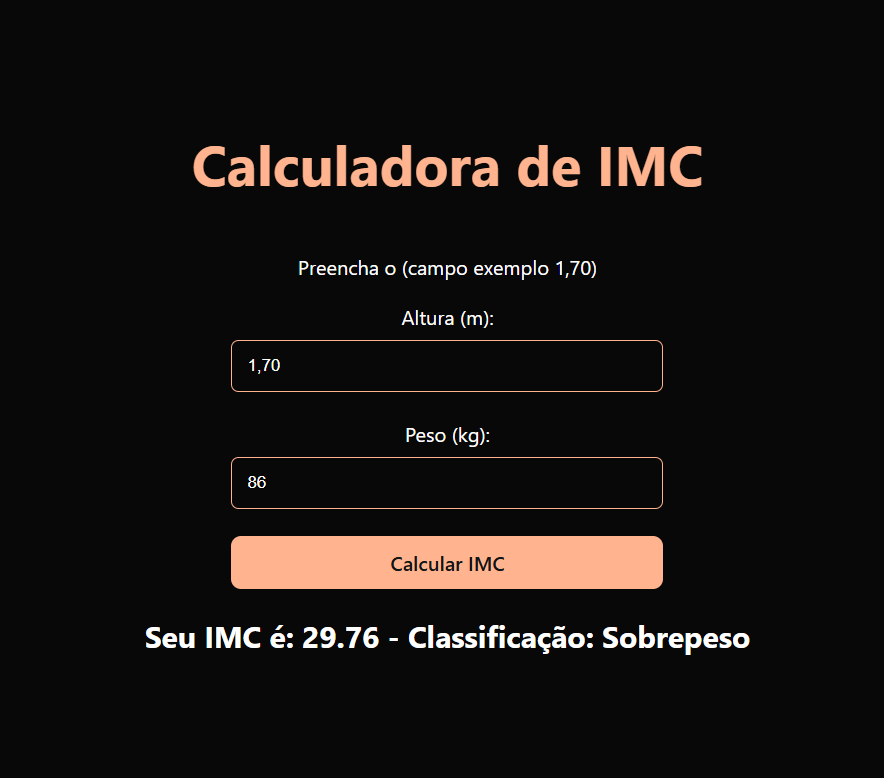

## Calculadora de IMC

Este projeto é uma calculadora de IMC (Índice de Massa Corporal) que permite ao usuário calcular seu IMC com base em sua altura e peso. O IMC é um indicador utilizado para classificar o peso de uma pessoa em relação à sua altura e fornece uma estimativa de magreza, normalidade, sobrepeso ou obesidade.

## Funcionalidades
Entrada de dados de altura e peso do usuário
Cálculo automático do IMC com base na fórmula: IMC = peso / (altura * altura)
Exibição do resultado do IMC e a classificação de acordo com a tabela da OMS:
Abaixo de 18,5: Abaixo do peso
Entre 18,5 e 24,9: Peso normal
Entre 25,0 e 29,9: Sobrepeso
30,0 e acima: Obesidade

## Como Usar
Clone o repositório em sua máquina:
git clone https://github.com/AndressaTurchetto/calculadoraIMC.git

Acesse a pasta do projeto: cd calculadora-imc e instale as dependências com npm install

Insira sua altura e peso nos campos apropriados.

O resultado do IMC e sua classificação serão exibidos automaticamente.

Exemplo de Uso
Se um usuário insere:

Peso: 70 kg
Altura: 1,75 m
O cálculo do IMC será:
IMC = 70 / (1.75 * 1.75) = 22.86
Classificação: Peso Normal

## Licença
Esse projeto é licenciado sob a Licença MIT.

